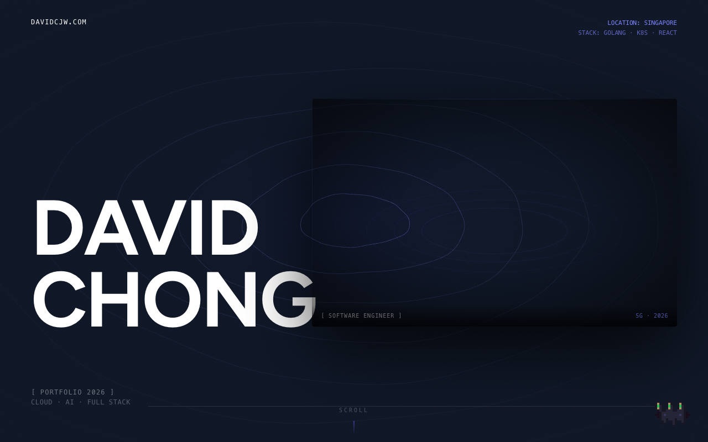

# davidcjw.com — Personal Landing Page

[](https://github.com/davidcjw/davidcjw-landing-page/actions/workflows/ci.yml)


Portfolio site for David Chong, a software engineer based in Singapore. Deployed at [davidcjw.com](https://davidcjw.com).

<p align="center">
  
</p>

## Stack

- **Next.js 16** (App Router) + **React 19**
- **Tailwind CSS v4** (config-less, via PostCSS)
- **Framer Motion v12** — animations and spring physics
- **Figtree** — Google Font
- TypeScript, deployed on Vercel

## Development

```bash
npm install
npm run dev       # http://localhost:3000
npm run build     # production build
npm run lint      # eslint
```

## Routes

- `/` — single-page home (hero, experience, top-4 portfolio teaser, contact)
- `/portfolio` — dedicated "building in public" portfolio page: stats, filterable
  project grid, and build principles. Sourced from the same `projects` array.

## SEO & analytics

- **Social-share images** — generated at build via `next/og`:
  `app/opengraph-image.tsx` (home) and `app/portfolio/opengraph-image.tsx`.
- **Metadata** — `app/layout.tsx` sets `metadataBase`, a title template, canonical
  URLs, and OpenGraph/Twitter tags; each route adds its own `title`/canonical.
- **`app/sitemap.ts`** + **`app/robots.ts`** — generated `/sitemap.xml` and `/robots.txt`.
- **Analytics** — `@vercel/analytics` mounted in `app/layout.tsx` (`<Analytics />`).

## Content

All content lives in [`app/data.ts`](app/data.ts) — edit the `experiences` and `projects` arrays to update the page. The `/portfolio` page and the home portfolio section both read from `projects`, so one edit updates both.

**Curating which projects show:** every project supports an optional `hidden?: boolean`. Set `hidden: true` to keep a project in the list but hide it from the site (home + `/portfolio`) — your switch for weaker or unfinished projects, no deletion needed. Projects with no `url` or `github` render as non-clickable cards.

## Structure

```
app/
  layout.tsx          root layout (font, metadata)
  page.tsx            home page (composes all sections)
  icon.tsx            favicon (32×32 PNG, generated)
  globals.css         global styles
  components/
    Navbar.tsx
    HalideTopoHero.tsx
    ExperienceSection.tsx
    ExperienceCard.tsx
    PortfolioSection.tsx      home portfolio teaser
    PortfolioCard.tsx         shared project card
    PortfolioPageHero.tsx     /portfolio header + stats
    PortfolioExplorer.tsx     /portfolio filterable grid
    BuildPrinciples.tsx       /portfolio "how I build" strip
    Footer.tsx
  portfolio/
    page.tsx          /portfolio route
  data.ts             experiences + projects content
blocks/               reusable animation primitives
```

See [`CODEBASE.md`](CODEBASE.md) for a full map of the repo.

## Contributing

This is a personal site, but fixes and suggestions are welcome — open an issue to discuss, or:

1. Fork the repo
2. Create a feature branch (`git checkout -b feature/your-feature`)
3. Commit your changes (`git commit -m 'feat: describe change'`)
4. Push and open a pull request

Please make sure `npm run lint` and `npm run build` pass before submitting a PR.

## Code of Conduct

This project follows the [Contributor Covenant v2.1](https://www.contributor-covenant.org/version/2/1/code_of_conduct/).
By participating you agree to uphold a welcoming, harassment-free environment.

## License

Distributed under the MIT License. See [LICENSE](LICENSE) for details.
